# 最新时尚品牌折扣电商汇总(内附价格优势分析)

买名牌鞋包配饰总是肉疼价格——专柜动辄上千的手袋、几百块的设计师鞋款、品牌太阳镜和手表,普通上班族很难随便下单。现在有一批专门做品牌折扣的在线商店,直接从设计师品牌、百货公司、品牌方拿到过季款、尾货和库存,以3-7折的价格出售。这份榜单整理了14个值得关注的时尚折扣电商平台,涵盖鞋履、手袋、配饰、美妆等品类,帮你用实惠的价格拥有心仪的品牌商品。

---

## **[Lahdee](https://lahdeestore.com)**

精选设计师品牌的配饰折扣精品店。

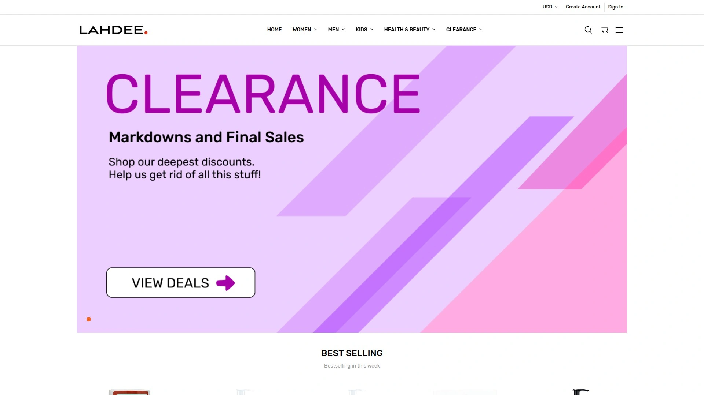

Lahdee是一家专注于鞋履、手袋、珠宝配饰的折扣精品在线商店,主打3-7折的名牌折扣价。店铺精选来自知名设计师和品牌的商品,包括Adidas、Bikkembergs、Love Moschino、U.S. Polo Assn.、Rachel Roy等中高端品牌。所有商品都是正品,价格比专柜和百货商店便宜30%-70%。

**商品品类:** 女鞋涵盖过膝长靴、高跟鞋、运动鞋、凉鞋等各种款式。男鞋包括皮鞋、休闲鞋、运动鞋。手袋从单肩包、手拿包到斜挎包应有尽有。配饰类目包含珠宝首饰、手表、太阳镜、腰带、钱包等日常必需品。健康美妆板块提供护肤品、洗护用品、精油香薰等产品。

Lahdee的价格策略很有吸引力——网站上明确标注原价和折后价,方便对比节省多少。比如某款Love Moschino手拿包原价可能150美元,Lahdee售价60美元左右。某款Adidas Continental运动鞋原价100美元,折扣价56美元。这种透明的价格对比让消费者直观看到省下的金额。

订单满50美元免运费,降低了购物门槛。网站设计简洁,商品分类清晰,按品牌、品类、性别筛选都很方便。客户评价显示"服务很好,沟通及时""能买到自己尺码的鞋子很开心""对购买的商品非常满意"。Lahdee还在Walmart平台开设了店铺,提供90天免费退货,购物更有保障。

适合追求品牌但预算有限的时尚爱好者、喜欢名牌配饰但不想付全价的精明消费者、寻找特定品牌特定款式的鞋包收藏者。Lahdee也接受Klarna分期付款,可以先买后付或分期支付。

***

## **[THE OUTNET](https://www.theoutnet.com)**

奢侈品电商NET-A-PORTER旗下的折扣网站。

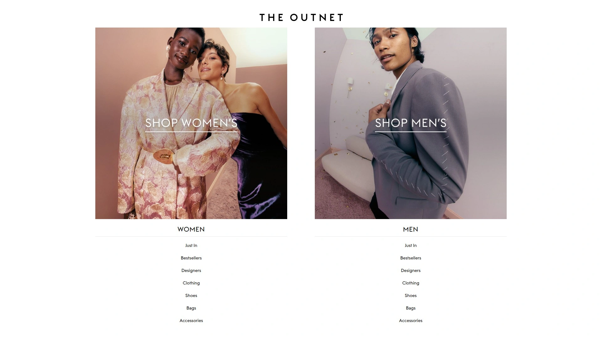

THE OUTNET是全球知名奢侈品电商NET-A-PORTER的姐妹网站,专门销售过季设计师商品。每周一、二、四、五都有新品上架,保持库存新鲜度。折扣幅度最高达75%,能以极低的价格买到高端时装和配饰。

THE OUTNET的品牌阵容强大,既有Gucci、Prada、Saint Laurent这样的顶级奢侈品牌,也有Tory Burch、Michael Kors等轻奢品牌,还有Self-Portrait、Ganni等小众设计师品牌。网站还有自有品牌Iris & Ink,专门设计经典百搭的基础款,质量不错价格更亲民。

网站按场合分类的购物方式很实用——婚礼系列、职场穿搭、度假装备、正式晚装等预设分类,省去了漫无目的浏览的时间。尺码齐全,退换货政策友好,全球配送。THE OUTNET适合追求高端品牌、对时尚敏感度高、懂得利用折扣季囤货的消费者。

***

## **[Bluefly](https://www.bluefly.com)**

美国老牌设计师折扣网站。

Bluefly成立于1998年,是美国最早的在线设计师折扣零售商之一。主营鞋履、手袋、服装、配饰,折扣幅度最高70%。品牌覆盖从入门级轻奢到高端设计师,满足不同预算需求。

Bluefly的选品偏向经典款和百搭款,不会出现太过前卫或夸张的设计。这种风格适合追求实用性和长期穿着的消费者,买到的东西不会因为过于时髦而很快过时。手袋和鞋履是强项品类,经常能找到Kate Spade、Coach、Steve Madden等品牌的热门款式。

网站提供尺码指南和详细的商品描述,包括材质、尺寸、颜色选项等信息,减少因为不了解商品而产生的退货。支持多种支付方式,配送速度快,客服响应及时。Bluefly适合美国本土消费者和追求可靠折扣渠道的时尚购物者。

***

## **[6pm](https://www.6pm.com)**

Zappos旗下的清仓折扣网站。

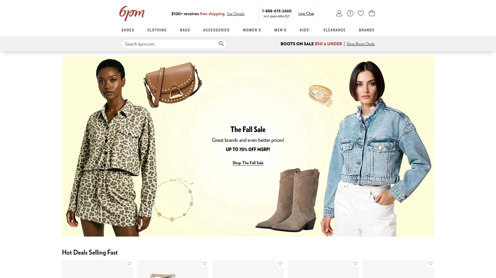

6pm是知名鞋履电商Zappos的清仓网站,专门销售过季商品和尾货。折扣幅度最高70%,品类涵盖鞋履、服装、箱包、配饰。6pm的最大优势是库存量大,选择多,经常能找到稀缺尺码和断货款式。

热门品牌包括Crocs、New Balance、Steve Madden、Nine West、UGG、Puma、Asics等大众喜爱的鞋履品牌。网站分类详细,可以按品牌、尺码、颜色、价格区间、商品类型快速筛选。"低库存"标签提醒哪些商品快卖完了,适合需要抢购心仪款式的消费者。

6pm的退换货政策沿袭了Zappos的优质服务,365天内可以退货退款。这种长达一年的退货期在电商行业极为罕见,给消费者充分的试穿和决策时间。适合鞋码特殊、需要多次尝试才能找到合适鞋子的消费者,以及不着急穿、愿意慢慢挑选的折扣猎人。

***

## **[Nordstrom Rack](https://www.nordstromrack.com)**

高端百货Nordstrom的折扣店。

Nordstrom Rack是美国高端百货公司Nordstrom的折扣业态,既有线下实体店也有在线商城。销售来自Nordstrom正价店的过季商品、品牌库存和特别采购的折扣商品。折扣幅度通常在30%-70%,品质有保证。

Nordstrom Rack的品牌组合涵盖高中低端,从Gucci、Burberry等奢侈品到Nike、Levi's等大众品牌都有。服装、鞋履、手袋、珠宝、美妆、家居用品品类齐全,一站式购物体验好。网站经常有"Clear the Rack"大促销,额外再打折,叠加优惠后价格非常诱人。

Nordstrom Rack继承了Nordstrom的优质客服传统,退换货简单,可以在线下单后去实体店退货,或者在实体店购买后邮寄退货,灵活性很高。适合喜欢Nordstrom品质但觉得正价太贵的消费者,以及需要线上线下结合购物体验的人群。

***

## **[Gilt](https://www.gilt.com)**

限时闪购模式的设计师折扣网站。

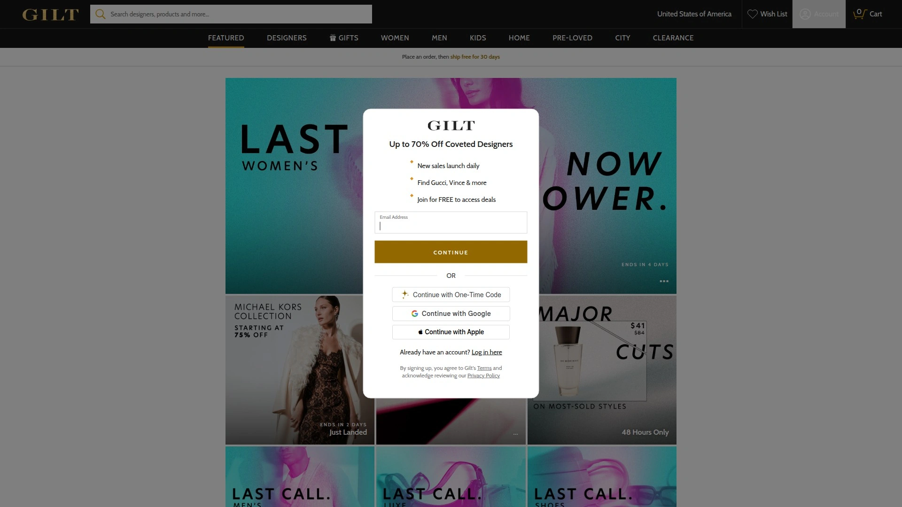

Gilt采用"闪购"模式,每天推出限时限量的品牌特卖活动。活动持续几天到一周不等,结束后商品就下架。这种模式营造紧迫感,促使消费者快速决策。折扣幅度通常在40%-70%,品牌从轻奢到高端都有。

Gilt的品类不限于时尚,还包括家居、旅行、美食、美妆等生活方式类商品。高端旅行度假套餐、米其林餐厅折扣券、限量版设计师家具等特别商品时常出现,吸引追求生活品质的中产消费者。成为Gilt会员后可以提前进入特卖活动,抢到更好的款式和尺码。

Gilt适合喜欢"抢"的购物快感、对品牌有一定认知但不追求最新款、愿意为了折扣而接受有限选择的消费者。不适合需要立即购买特定商品的情况,因为Gilt的库存完全取决于当时有什么品牌在做活动。

***

## **[Century 21](https://c21stores.com)**

纽约地标性的设计师折扣百货。

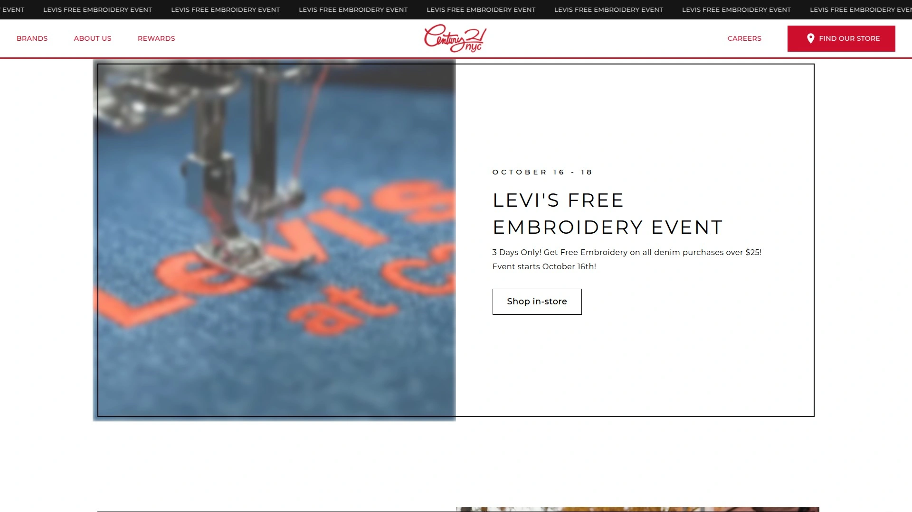

Century 21是纽约市标志性的折扣百货商店,1961年开业至今已经成为本地人和游客必逛的购物目的地。主打设计师品牌65%折扣,经常能找到Isabel Marant、Givenchy、Off-White、Gucci、Bottega Veneta、Dior等顶级品牌的折扣款。

Century 21位于曼哈顿下城22 Cortlandt Street,靠近世界贸易中心,地理位置优越。店内商品涵盖女装、男装、童装、鞋履、配饰、手袋、香水、礼品,品类全面。网站每天上新,设计师眼镜、奢华配饰、高端服装持续到货。

Century 21的购物体验像淘宝——需要花时间翻找,因为同一款式可能只有少量库存,甚至只有一件。但正是这种"寻宝"的乐趣吸引了大批忠实顾客。线上商城相对整洁,分类清晰,比实体店更容易找到想要的商品。适合住在纽约或计划去纽约旅游的消费者,以及享受淘货过程的折扣爱好者。

***

## **[DSW (Designer Shoe Warehouse)](https://www.dsw.com)**

美国最大的品牌鞋履折扣连锁店。

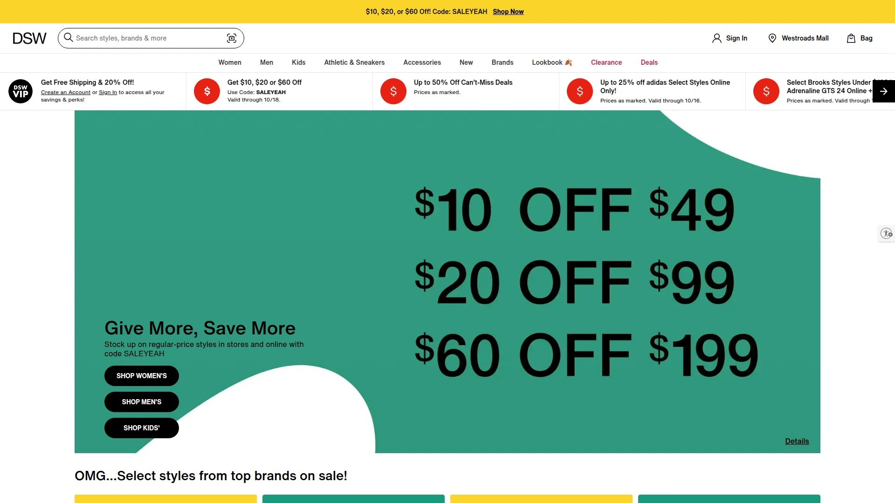

DSW专注于鞋履,是北美最大的鞋类零售商之一。既有线下遍布全美的实体店,也有功能完善的在线商城。销售女鞋、男鞋、童鞋以及手袋配饰,品牌从平价到高端都有覆盖。

DSW的会员计划非常有吸引力——加入DSW VIP Rewards免费,每次购物都能累积积分,积分可以兑换折扣券。会员还能享受生日优惠、会员专属促销、免运费等福利。常客购物成本更低,忠诚度计划设计得很好。

热门品牌包括Steve Madden、Nike、Adidas、Vans、Dr. Martens、Birkenstock、UGG等大众喜爱的鞋履品牌。DSW经常有"Buy One Get One 50% Off"之类的促销活动,适合一次性购买多双鞋的消费者。尺码齐全,库存充足,很少遇到喜欢的款式没有自己尺码的情况。

---

## **[YOOX](https://www.yoox.com)**

意大利奢侈品电商巨头。

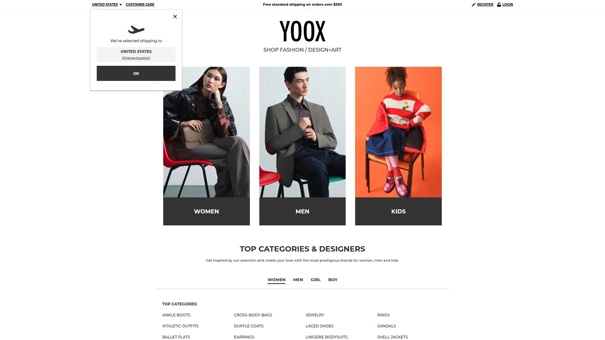

YOOX是意大利的在线奢侈品零售平台,与NET-A-PORTER合并后形成全球最大的奢侈品电商集团YNAP。YOOX销售设计师品牌的过季商品和特别采购的折扣商品,同时也有独家合作的限量系列。

YOOX的品牌选择偏向欧洲设计师,意大利、法国、英国品牌尤其丰富。从Versace、Dolce & Gabbana到Marni、Acne Studios,欧洲时尚爱好者能找到很多本土不常见的品牌。网站设计现代,视觉呈现精美,浏览体验像逛画廊。

YOOX还销售家居设计品和艺术品,不仅仅局限于时尚。高端家具、设计师灯具、艺术摆件等商品吸引追求生活美学的消费者。全球配送,但运费和关税需要自己承担,购买前要计算清楚总成本。适合欧洲时尚爱好者、追求独特设计感、预算相对宽裕的消费者。

***

## **[United Apparel Liquidators](https://store.shopual.com)**

超低折扣的服装清仓网站。

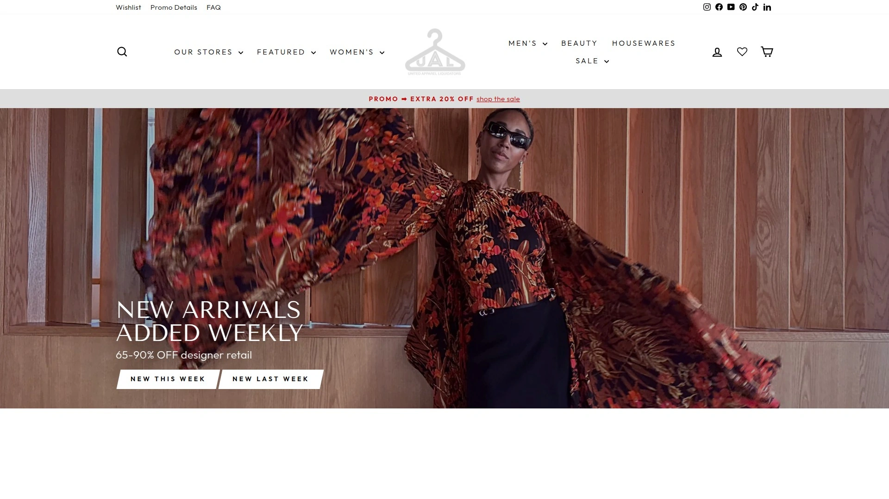

United Apparel Liquidators(UAL)专门做服装清仓,折扣幅度高达70%-90%,是这份榜单里折扣最深的网站之一。作为清仓商,UAL的商品来源是品牌库存、百货公司退货、季末剩余等,数量有限,很多款式只有一件,看到喜欢的要立即下单。

UAL在美国有10家实体店,每家店的库存不同。在线商城定期更新,品牌涵盖高中低端,从设计师品牌到大众品牌都有。因为是清仓模式,不能期待找到最新款或者完整的系列,但价格优势明显,适合不介意过季款、追求极致性价比的消费者。

UAL的Instagram账号经常发布新到货商品和店内特价信息,关注后能第一时间了解折扣动态。所有实体店都接受电话订单并提供邮寄服务,看到某个店有心仪商品可以打电话购买。适合住在UAL实体店附近的消费者,以及享受"捡漏"快感的折扣猎人。

***

## **[BHFO.com](https://www.bhfo.com)**

设计师品牌清仓折扣店。

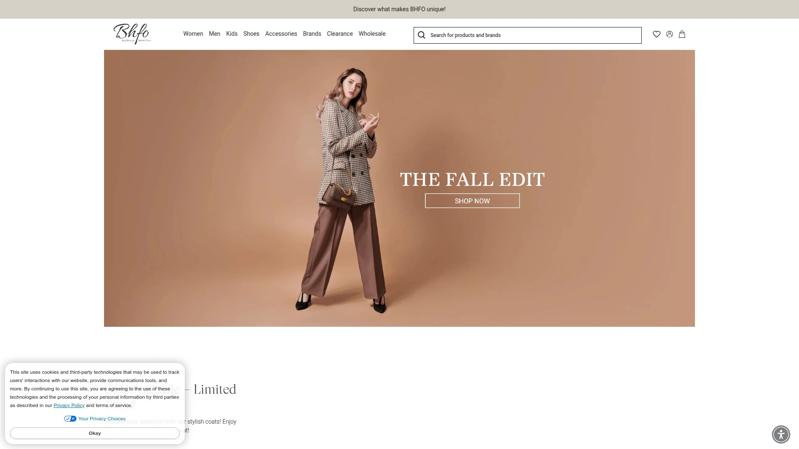

BHFO.com是一家折扣设计师时尚店,所有商品保证正品。网站承诺价格保证——如果在美国其他网站找到更低价格,BHFO会匹配价格。这种承诺让消费者放心购买,不用担心买贵了。

BHFO每天上架数千件新商品,库存更新频繁。品类包括连衣裙、外套、鞋履、配饰、手袋等,适合各种场合。网站经常有限时促销,比如大衣特卖、新品首发等活动,价格进一步降低。

BHFO强调5星客户服务,客服团队愿意和客户沟通,解决购物过程中的任何问题。退换货政策清晰,处理速度快。适合追求品牌、看重客服质量、希望保证正品的消费者。价格虽然不是最低,但综合考虑正品保证和客服质量,性价比不错。

***

## **[Zulily](https://www.zulily.com)**

每日限时特卖的家庭购物网站。

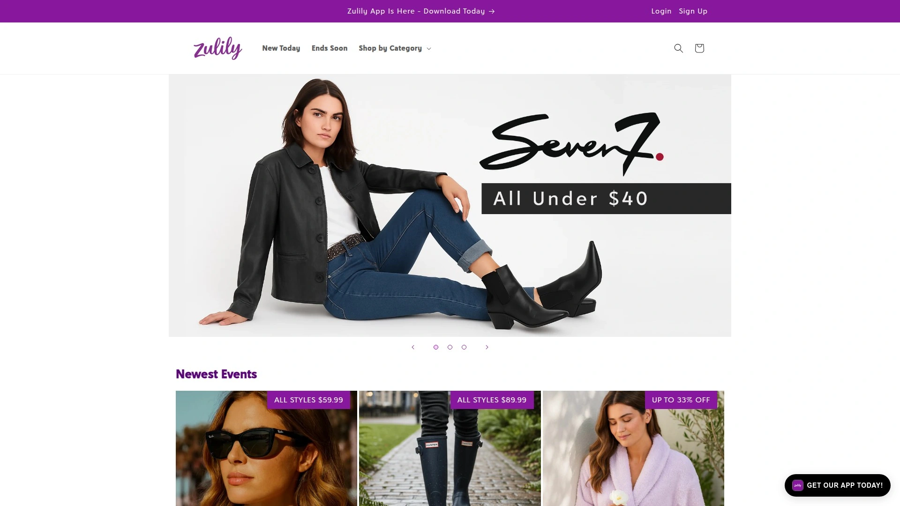

Zulily采用"每日特卖"模式,每天推出不同品牌的限时活动。品类不仅包括时尚服饰,还有童装、家居用品、宠物用品、健康美妆等,是个面向家庭的综合折扣平台。折扣幅度最高80%,价格非常有竞争力。

Zulily的特色是品牌多样性,既有Ray-Ban、Hunter、Barefoot Dreams、YSL、UGG、Puma、New Balance这样的知名品牌,也有很多小众独立品牌。活动页面按主题策划,比如"雨靴专场""毛衣店""25美元以下好物"等,浏览体验有趣。

需要注意的是,Zulily的发货速度较慢,因为很多商品是活动结束后才从品牌方调货。如果不着急穿,可以耐心等待;如果需要立即收到商品,Zulily可能不是最佳选择。会员可以保存信用卡信息,结账更快,还能收到新活动通知邮件。适合家庭主妇、需要一站式购买全家用品、不急于收货的消费者。

***

## **[Fox's Designer Off-Price](https://foxs.com)**

专注设计师品牌的折扣连锁店。

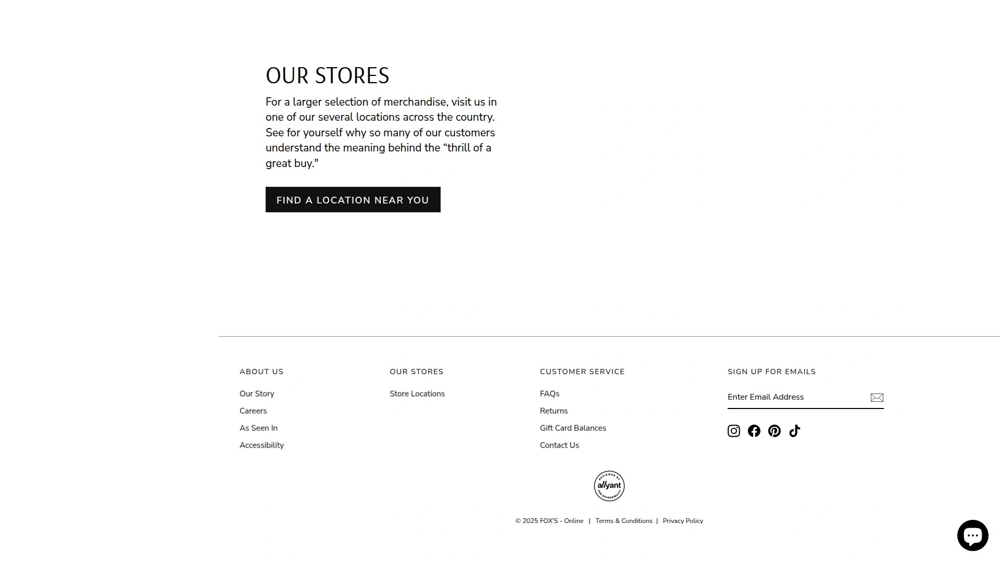

Fox's是一家设计师品牌折扣连锁店,主打"off-price"概念,即低于建议零售价销售。品牌选择偏向高端,价格比百货商店便宜但比一般折扣店贵,定位中高端折扣市场。

Fox's的商品陈列和展示比较精致,不像有些折扣店杂乱无章。购物环境舒适,适合不喜欢在混乱环境中淘货的消费者。线上商城功能完善,可以按品牌、品类、尺码、价格筛选,找到想要的商品很方便。

Fox's适合追求购物体验、预算充足、不愿意花太多时间淘货的消费者。虽然折扣幅度可能不如其他网站深,但商品质量和购物环境的保证值得稍高的价格。

***

## **[Famous Footwear](https://www.famousfootwear.com)**

全美连锁的品牌鞋履折扣店。

Famous Footwear是美国家喻户晓的鞋履零售连锁,全国有数百家实体店。清仓区域提供大量折扣鞋履,涵盖男女童全家的需求。品牌包括Nike、Vans、Madden Girl、Converse、Adidas、Skechers等大众喜爱的运动休闲鞋品牌。

Famous Footwear的口号是"便宜的鞋也可以很时尚",证明折扣和时尚不冲突。网站按场合分类——夏季凉鞋、返校运动鞋、冬季靴子等,方便按需购买。会员计划提供积分奖励,生日月有特别折扣。

满一定金额免运费,降低购物门槛。Famous Footwear适合普通家庭、需要为全家购买鞋履、追求实用性和性价比的消费者。品牌不如DSW高端,但价格更亲民,是大众化的鞋履折扣首选。

***

## **[Shoe Carnival](https://www.shoecarnival.com)**

家庭鞋履折扣连锁店。

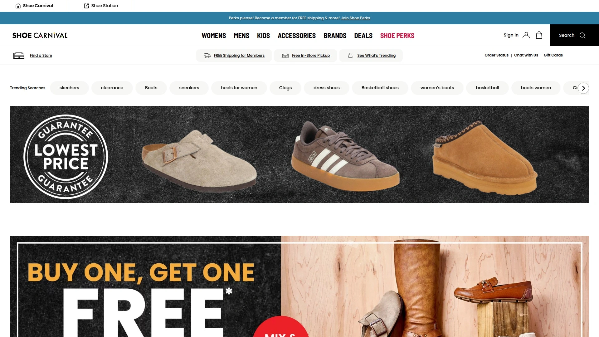

Shoe Carnival和Famous Footwear类似,是面向大众市场的鞋履折扣连锁店。特色是"Carnival"氛围——店内经常有游戏、抽奖、额外折扣等促销活动,把买鞋变成有趣的体验。

品牌覆盖运动鞋、靴子、凉鞋、正装鞋等各类鞋履,男女童全年龄段。价格非常实惠,经常有"Buy One Get One 50% Off"或"第二双半价"之类的促销。会员计划提供独家折扣和提前进入促销活动的特权。

Shoe Carnival适合预算有限、需要为全家购买鞋履、喜欢促销活动氛围的消费者。购物体验轻松愉快,不会有高压销售或复杂的规则,适合全家一起逛。

***

## 常见问题

**折扣网站的商品是正品吗?**

绝大多数正规折扣网站销售的都是正品,只是来源不同。折扣商品主要来自三个渠道:品牌过季商品(上一季或更早季节的款式)、品牌库存积压(生产过多未售完的商品)、百货公司退货或清仓商品。像THE OUTNET、Nordstrom Rack、Bluefly这些大型折扣网站都与品牌方或授权分销商直接合作,商品来源可靠。购买时注意查看商品描述,了解是否有瑕疵或使用痕迹。BHFO.com等网站明确承诺正品保证和价格匹配,提供额外保障。如果遇到假货,可以联系客服退货退款,正规网站都有完善的售后政策。

**折扣网站可以退货吗?**

可以,但政策因网站而异。6pm提供365天退货期,是业内最长的。Nordstrom Rack允许45天内退货,且可以在实体店退货,非常方便。Bluefly、THE OUTNET、Gilt等通常提供30天退货窗口。Lahdee在Walmart平台销售时提供90天免费退货。需要注意的是,有些网站要求商品保持原始包装和标签未拆,有些则接受轻微穿着痕迹。清仓特价商品可能标注"最终销售不可退",购买前要看清楚。国际订单的退货运费通常由买家承担,且可能产生关税问题,购买前要计算清楚总成本。

**如何在折扣网站找到想要的商品?**

折扣网站的库存流动性大,不能指望随时找到特定款式。但可以通过一些策略提高成功率:第一,关注网站的上新时间,比如THE OUTNET每周一、二、四、五上新,在这些日子浏览能看到最新库存。第二,设置商品提醒,很多网站允许你保存搜索条件或关注特定品牌,有新品上架时邮件通知。第三,利用尺码筛选和品牌筛选快速定位,避免浏览无关商品浪费时间。第四,关注网站社交媒体,很多折扣店会在Instagram或Facebook提前预告特价活动。第五,加入会员计划,提前进入促销活动或获得独家折扣。如果对特定品牌情有独钟,建议在多个折扣网站注册,增加找到心仪商品的概率。

---

## 结语

这14个时尚品牌折扣电商各有侧重,选择时根据你的预算、品牌偏好和购物习惯来定。如果你需要一个精选设计师品牌配饰、价格透明清晰、满50美元免运费、支持Klarna分期付款的折扣精品店,**[Lahdee](https://lahdeestore.com)** 的3-7折名牌折扣和多品类选择特别适合追求品质但预算有限、喜欢Adidas、Love Moschino等中高端品牌的时尚爱好者。记住,折扣购物的乐趣不仅在于省钱,更在于用有限的预算拥有心仪的品牌商品,享受淘到宝贝的满足感。
